# Smart POS System

A desktop Point of Sale (POS) application built using C# WinForms and SQL Server.  
The system simulates a real-world retail/restaurant POS workflow including order processing, payments, and system configuration.

---

## Features

- User management (add, edit, navigate users)
- Category and item management
- POS order and check system
- Multiple payment methods
- Receipt customization
- System configuration (restaurant info, printer settings)

---

## Architecture

---

## Database

The project uses SQL Server.

To set up the database:

1. Open SQL Server Management Studio (SSMS)
2. Open:
   database/schema.sql
3. Execute the script

This will create the database and all required tables.

---

## Technologies

- C#
- WinForms (.NET Framework)
- SQL Server
- ADO.NET

---

## Running the Application

1. Open:
   PointOfSale.sln
2. Update the connection string in App.config
3. Run the project
